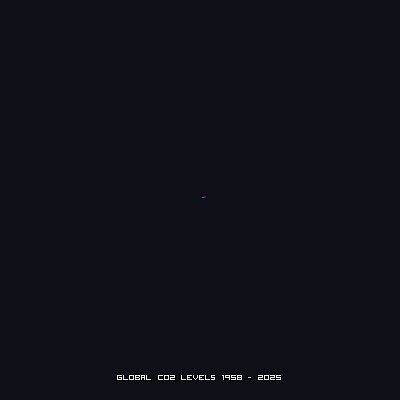

# Keeling Spiral

An animated radial visualization of atmospheric CO₂ measured at Mauna Loa
Observatory — the Keeling Curve — from 1958 to today.

Each loop around the circle is one year (angle = day of year), and the
distance from the center is the CO₂ concentration. The seasonal
"breathing" of the planet shows up as the wobble in each ring; the relentless
outward march is us.



## Running it

```bash
python3 -m venv .venv && source .venv/bin/activate
pip install -r requirements.txt
python3 keeling_radial.py
```

This produces a static `keeling_radial.png` / `keeling_radial.svg` and an
animated GIF (timestamped filename). The full-quality render (1920px, 40fps,
16 seconds) takes several minutes.

The repo ships with a snapshot of the daily Mauna Loa dataset
(`daily_in_situ_co2_mlo.csv`). If you delete it, the script falls back to
fetching the latest *monthly* data from NOAA/Scripps at runtime. To refresh
the daily data, download it from the
[Scripps CO₂ Program](https://scrippsco2.ucsd.edu/data/atmospheric_co2/mlo.html)
(daily in-situ CO₂, Mauna Loa).

## Tuning the look

All the knobs live in the `make_radial_gif()` call inside `main()` — duration,
frame rate, resolution, the cyan/magenta pulse behavior, tail length, easing,
and the end-of-clip pause. The values checked in are the exact settings used
for the published render.

## Provenance

This is the exact code and dataset lineage behind **Gas Wars 6529 #461**
(February 19, 2026), minted for the
[6529 Memes collection](https://6529.io/). That GIF was rendered with the
settings checked into
`main()` at `dpi=120` (960×960); the defaults here render the same
560-frame animation at `dpi=240` (1920×1920). Note that renders are not
byte-reproducible: the glitch effect uses an unseeded random jitter, so a
few frames differ slightly on every run, and GIF palette quantization can
vary between Pillow versions. The original artifact is the file itself.

## Data attribution

- **Daily CO₂ data:** Scripps CO₂ Program, Scripps Institution of
  Oceanography (C. D. Keeling, S. C. Piper, et al.),
  [scrippsco2.ucsd.edu](https://scrippsco2.ucsd.edu/). Please credit the
  Scripps CO₂ Program when reusing the data.
- **Monthly fallback data:** NOAA Global Monitoring Laboratory,
  [gml.noaa.gov/ccgg/trends](https://gml.noaa.gov/ccgg/trends/).

## Font

The pixel font is **Visitor BRK** by Brian Kent (Ænigma Fonts), bundled in
`assets/fonts/` with his original readme. It is freeware — free for personal
and commercial use; redistribution is allowed as long as his readme stays
with the font, and it may not be sold or altered. See
`assets/fonts/visitor.txt`.

## License

The code is MIT licensed (see [LICENSE](LICENSE)). The bundled font and data
are covered by their own terms above.
